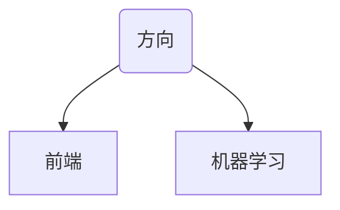

# 学习日志


##学会了什么
1. C语言排序算法:快速排序、堆排序......递归穷举组合数
```C
void pa(int j,int n,int k)
{
	int i;
	if(j>n)
	{
		return;
	}
	if(in==k)
	{
		if(k==1)
		{
			
			i=re[0];
		}
		else
		{
			i=mag(k);
		}
		if(i>end)
		{
			end=i;
		}
		return;
	}
	if(j<n)
	{
		re[in]=a[j];
	}
	in++;
	j++;
	pa(j,n,k);
	in--;
	pa(j,n,k);
	return;
}
```
2. 51单片机的使用

##学习进度
1. C语言->文件
2. 51单片机->数码管显示
##学习感悟：
做人嘛要潇洒一点，要学会把头发放下
##学习方向


###前端开发
* 前端指的是用户可见的界面，网站前端页面也就是网页的页面开发，比如网页上的特效、布局、图片、视频，音频等内容。前端的工作内容就是将美工设计的效果图的设计成浏览器可以运行的网页，并配合后端做网页的数据显示和交互等可视方面的工作内容。
* 前端开发用到的技术包括但不限于html5、css3、javascript、jquery、Bootstrap、Node.js 、Webpack，AngularJs，ReactJs，VueJs等技术。

###机器学习

* 机器学习是一门人工智能的科学，该领域的主要研究对象是人工智能，特别是如何在经验学习中改善具体算法的性能。
* 机器学习是对能通过经验自动改进的计算机算法的研究。
* 机器学习是用数据或以往的经验，以此优化计算机程序的性能标准。
* 学习路径：


##胡思乱想小项目
* 自动化网页界面生成软件（用户可以自己导入图片，放置链接，改变界面的各种框框，然后系统自动生成网页界面）
* 心情墙：所有用户都可以将自己的心情写在网页墙上